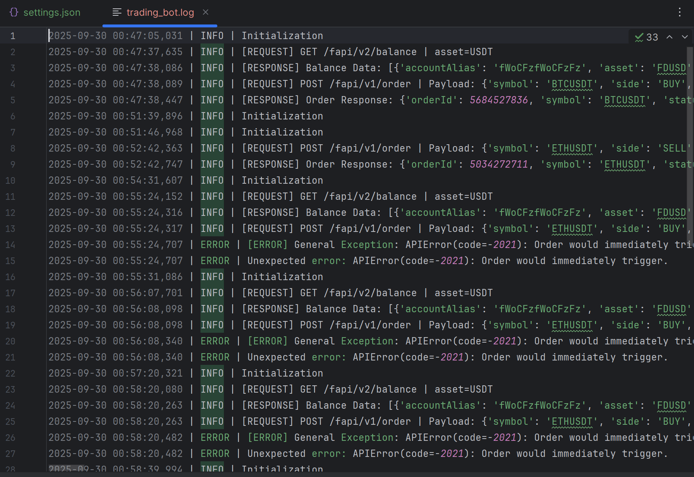
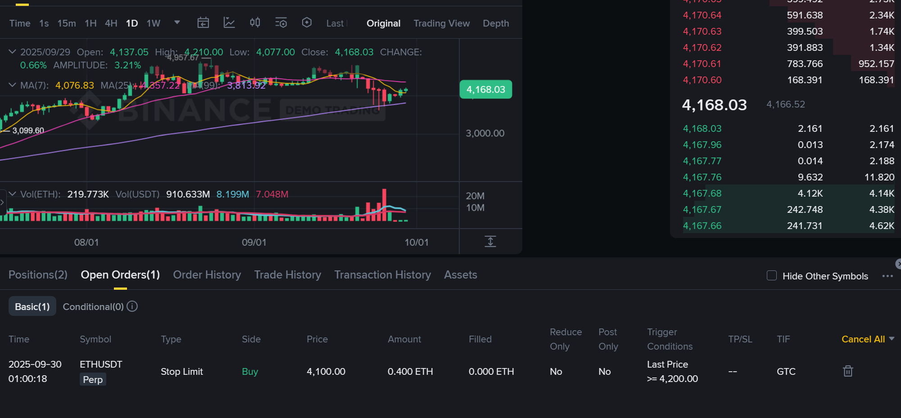
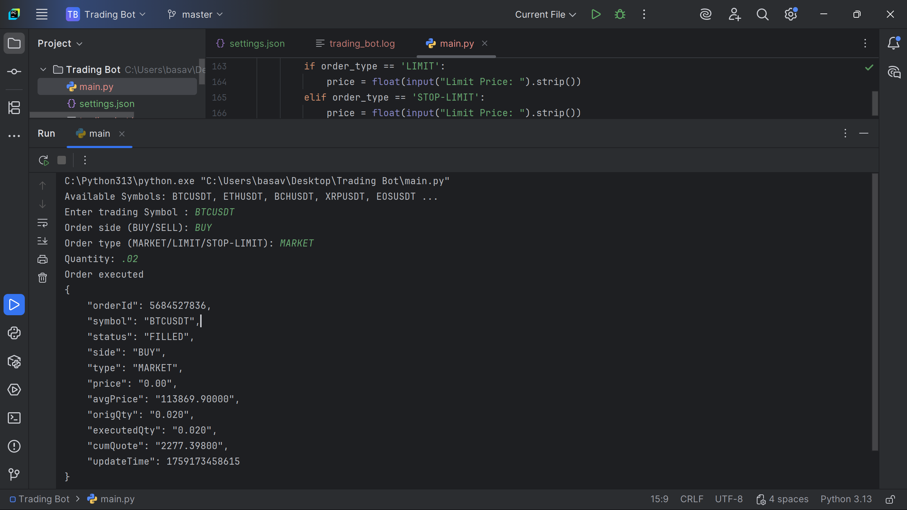
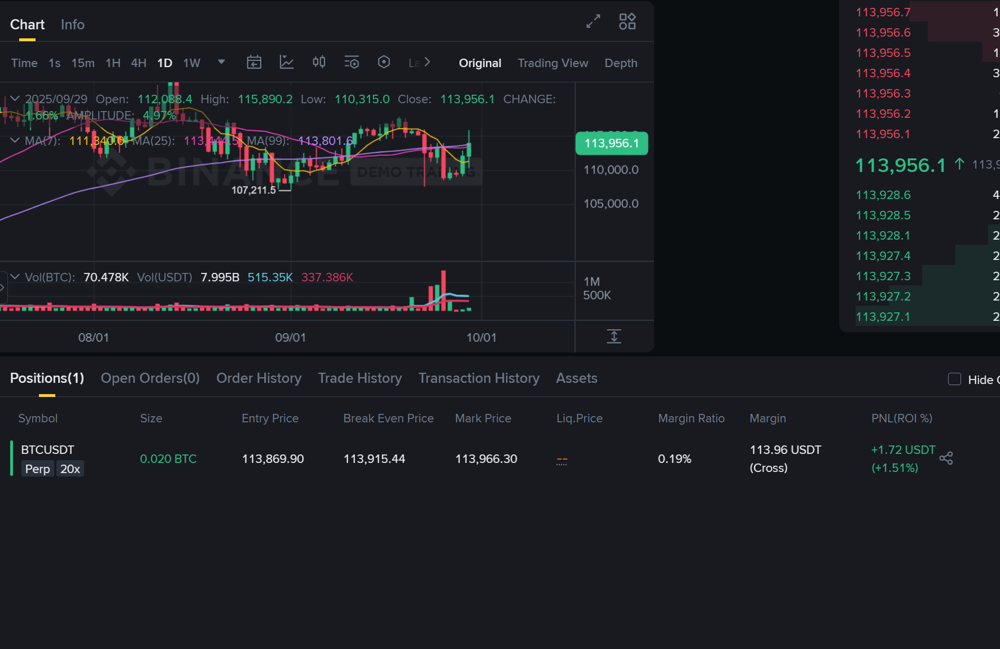
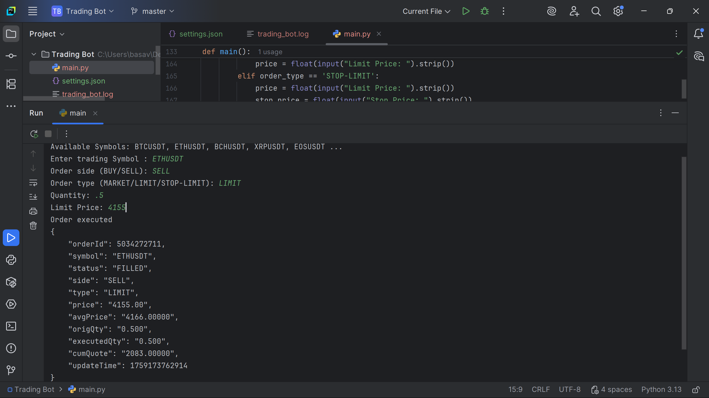
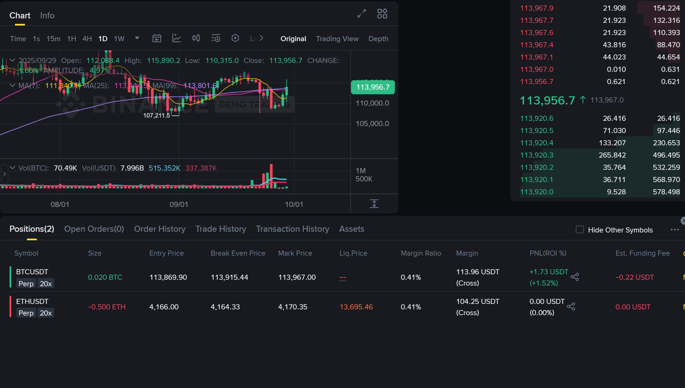
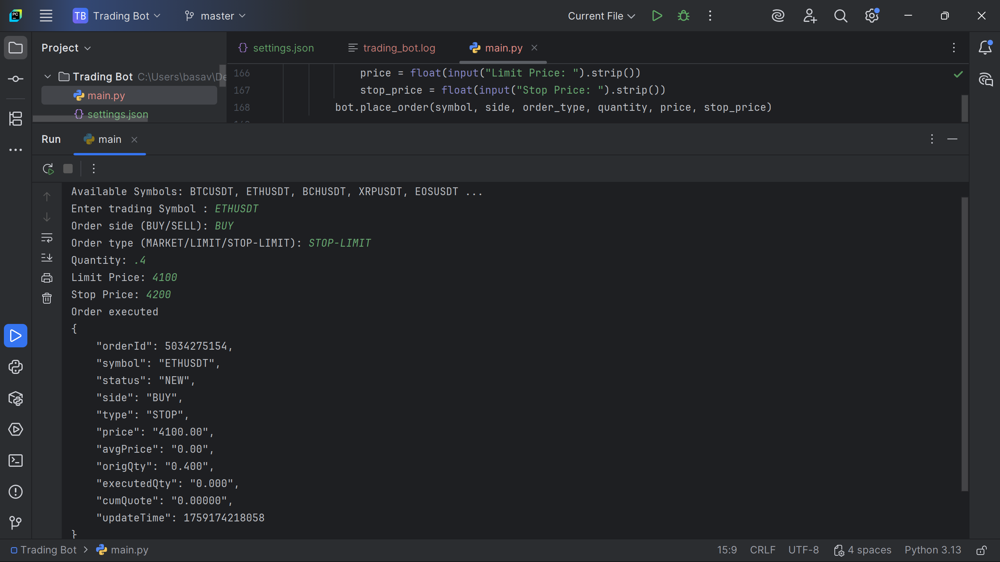
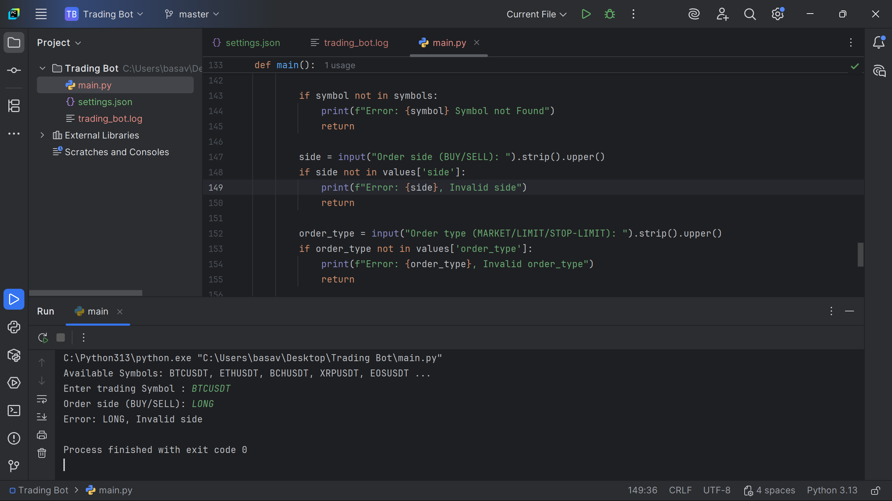

# Binance Futures Trading Bot

A Python-based trading bot for **Binance Futures Testnet**, enabling secure trading with Market, Limit, and Stop-Limit orders. It includes balance checks, input validation, and detailed logging for all trading activity.

---

## Project Structure

```
Trading Bot/
│
├── imgs/                  # Reference screenshots
│   ├── Error.png              # Invalid symbol entered
│   ├── Error StopLimit.png    # Stop-Limit order would immediately trigger
│   ├── Error1.png             # Insufficient balance error
│   ├── Limit.png              # Placing a Limit order
│   ├── Limit-Bina.png         # Binance response after Limit order
│   ├── Logfile.png            # Sample trading_bot.log output
│   ├── market.png             # Placing a Market order
│   ├── Market-Bina.png        # Binance response after Market order
│   ├── StopLimit.png          # Placing a Stop-Limit order
│   └── StopLimit-Bina.png     # Binance response after Stop-Limit order
│
├── main.py                # Main trading bot script
├── settings.json          # API key and secret (user-provided)
└── trading_bot.log        # Log file generated by the bot
```

---

## Features

* Secure API key loading from `settings.json`
* Connection to Binance Futures Testnet
* Fetch account balance (default: USDT)
* Place orders:

  * Market
  * Limit
  * Stop-Limit
* Input validation for symbols, order sides, and order types
* Logging of API requests, responses, and errors

---

## Setup

1. Clone the repository

```
git clone https://github.com/yourusername/trading-bot.git
cd trading-bot
```

2. Install dependencies

```
pip install python-binance
```

3. Create `settings.json` file

```json
{
    "api_key": "YOUR_API_KEY",
    "api_secret": "YOUR_API_SECRET"
}
```

4. Run the bot

```
python main.py
```

---

## Usage

1. Bot displays available trading symbols

2. Enter the trading symbol (e.g., BTCUSDT)

3. Select order side: BUY or SELL

4. Select order type: MARKET, LIMIT, or STOP-LIMIT

5. Provide required details:

   * Quantity
   * Price (for Limit orders)
   * Price + Stop Price (for Stop-Limit orders)

6. Order executes and summary is displayed

---

## Logging

Logs are stored in `trading_bot.log`.

Example entries:

```
2025-09-29 10:15:32 | INFO | [REQUEST] POST /fapi/v1/order | Payload: {...}
2025-09-29 10:15:33 | INFO | [RESPONSE] Order Response: {...}
2025-09-29 10:15:33 | ERROR | Insufficient balance
```

* shows sample log entries for request, response, and error events


---

## Reference Screenshots

### Errors

* Invalid symbol entered


* Insufficient USDT balance


* Stop-Limit order would immediately trigger


### Market Order

* Market order placed by bot


* Binance response after executing Market order



### Limit Order

* Limit order placed by bot

* Binance response after executing Limit order



### Stop-Limit Order

* Stop-Limit order placed by bot

* Binance response after executing Stop-Limit order


---


This is about Trading Bot

